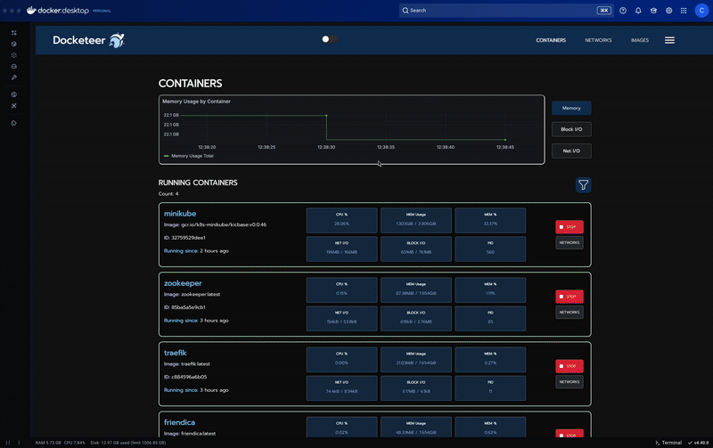
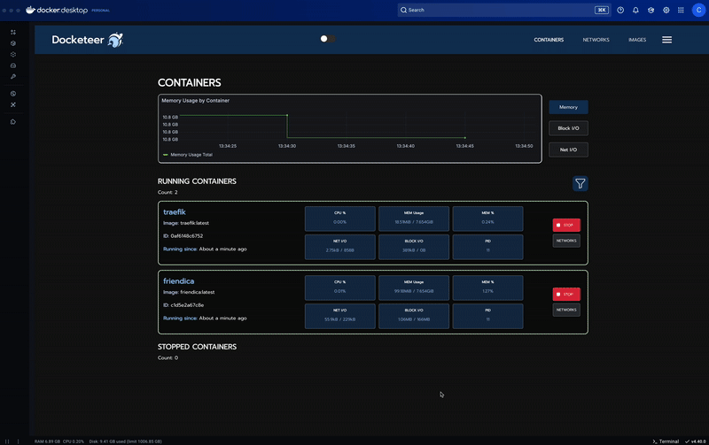
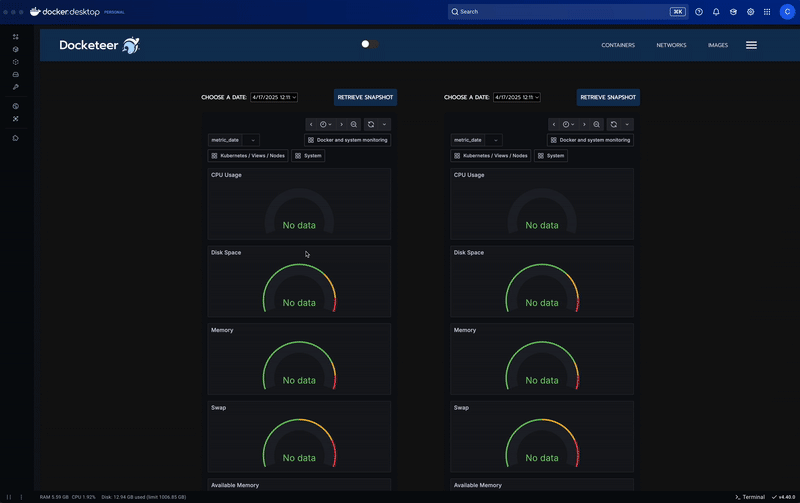
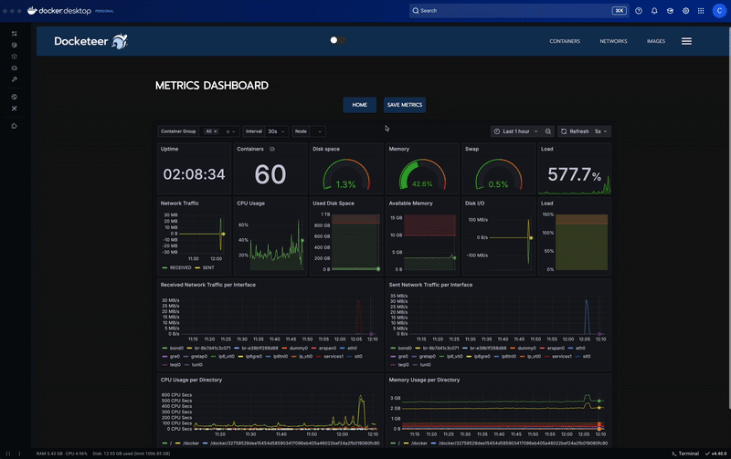
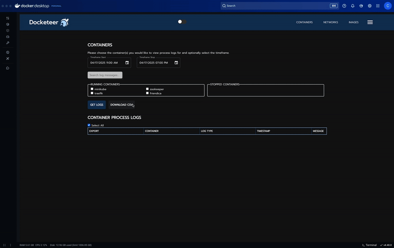
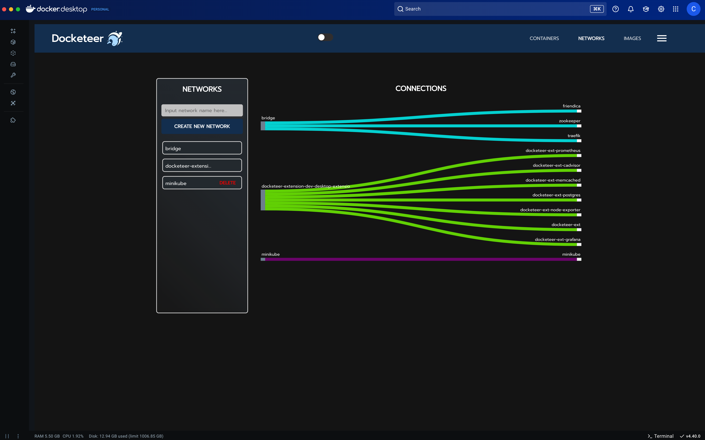
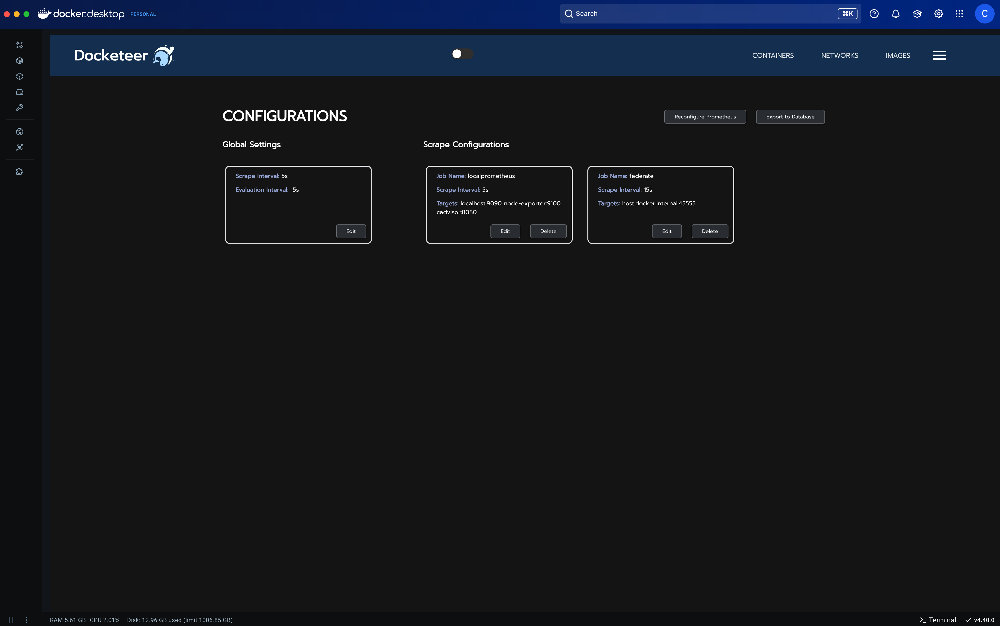

<!-- Improved compatibility of back to top link: See: https://github.com/othneildrew/Best-README-Template/pull/73 -->

<a name="readme-top"></a>

<!-- PROJECT SHIELDS -->
<!--
*** I'm using markdown "reference style" links for readability.
*** Reference links are enclosed in brackets [ ] instead of parentheses ( ).
*** See the bottom of this document for the declaration of the reference variables
*** for contributors-url, forks-url, etc. This is an optional, concise syntax you may use.
*** https://www.markdownguide.org/basic-syntax/#reference-style-links
-->


<div align="center" width="100%">   
            
[![Contributors][contributors-shield]][contributors-url]
[![Forks][forks-shield]][forks-url]
[![Stargazers][stars-shield]][stars-url]
[![Issues][issues-shield]][issues-url]
[![MIT License][license-shield]][license-url]
[![LinkedIn][linkedin-shield]][linkedin-url]
            
</div>
            
<!-- PROJECT LOGO -->


<!-- PROJECT LOGO -->
<br />
<div align="center">
  <a href="https://github.com/open-source-labs/Docketeer">
    
  </a>
  <br />
  https://dogketeer.com/<br>
<br/>
  
   <br /> 
  <p align="center">
  Docketeer is a developer-friendly application that provides a single interface for container and network management as well as metric visualization.  
    <br />
    <a href="https://github.com/open-source-labs/Docketeer"><strong>Explore the code & contribute here!»</strong></a><br />
    <a href="https://github.com/open-source-labs/docketeer-extension"><strong>See the extension version's code here!»</strong></a>
    <br />
    <br />
    <a href="https://github.com/open-source-labs/Docketeer/issues">Report Bug</a>
    ·
    <a href="https://github.com/open-source-labs/Docketeer/issues">Request Feature</a>
  </p>
</div>

<br />
<!-- TABLE OF CONTENTS -->


## Table of Contents

  <ol>
    <li>
    <a href="#about-the-project">About Docketeer</a></li>
    <li><a href="#features">Features</a></li>
    <li><a href="#installation">Installation</a></li>
    <li><a href="#documentation">Documentation</a></li>
    <li><a href="#contributing">Contributing</a></li> 
    <li><a href="#license">License</a></li>
  </ol>

<!-- ABOUT THE PROJECT -->

## About The Project     
</div>

Docketeer is an open source initiative comprised of contributions from dozens of talented and passionate software engineers. Our application provides a simple interface to manage Docker resources & visualize both host and container metrics. Docketeer is a containerized application that can be deployed alongside your application cluster with hardly any effort. To learn more about Docketeer and how to get started, continue reading!
<!-- FEATURES -->

## Features

- Docketeer is a Docker developer tool that's available as an open-source project on GitHub or as an extension on Docker Desktop.
- It aims to simplify the development process for projects that use Docker containers.
- Visualize and compare previously saved health metric snapshots to offer users a comprehensive understanding of historical performance.
- Allows you to filter through both your running and stopped container logs.
- Provides image vulnerability data for each image for enhanced understanding of the security of used images
- Docketeer provides an easy-to-use GUI for managing Docker containers, images, and networks.
- With Docketeer, developers can quickly start, stop, and delete containers, as well as manage run Docker images.
- Docketeer offers the ability to create, delete, and attach containers to networks.
- It's a community-maintained project, with frequent updates and bug fixes.
- Docketeer is licensed under the MIT license, meaning it can be used and modified freely, even for commercial projects.
- Read, modify, and save Prometheus configurations all within the extension

<p align="right">(<a href="#readme-top">back to top</a>)</p>

### What's New in Version 20.0.0?

| New Features                                                                                                                                     | Status    |
|---------------------------------------------------------------------------------------------------------------------------------------------|-----------|
| Setup an error catch to alert Users of errors that are in the Docker Container Log.                                                         | ✅        |
| Optimize frontend rendering performance with lazy loading to reduce initial bundle size and eliminating redundant re-renders.               | ✅        |   
| Complete update of all dependencies. Docketeer v20.0.0 is now fully compatible with Docker Desktop v4.40 as of 04/16/25.                    | ✅        |
| Improved frontend styling and global styling making it easier to make future improvements                                                 | ✅        |

- ✅ = Ready to use


| In Development                                                                                                                                    | Status    |
|---------------------------------------------------------------------------------------------------------------------------------------------|-----------|
| CI/CD pipeline for Docketeer repo.                                                                                                          | ⏳        |
| Improve test coverage with additional unit tests and integration tests.                                                                     | ⏳        |
| Optimize frontend rendering performance with lazy loading to reduce initial bundle size and eliminating redundant re-renders.               | ⏳        |
| Add support for more advanced Docker features, like multi-stage builds or Docker secrets, to expand the capabilities of Docketeer.          | ⏳        |
| Add the ability to control Docker containers deployed in AWS.                                                                               | ⏳        |
| Develop aggregation service to collect and cache data from prometheus data sources.                                                         | ⏳        |
| Implement endpoint scraping of any kubernetes cluster running prometheus. ([Read more](/docs/dev/features/Configuration(Alpha).md))         | ⏳        |
| Work on improving the connect/disconnect button under networks button in Containers Tab.                                                    | ⏳        |
| Adding additional key metrics to the snapshot functionality.                                                                                | ⏳        |
| Implement functionality that alerts users when certain metrics reach critical threshold.                                                    | ⏳        |
| Add functionality to load previously saved Prometheus configurations to the current container                                               | ⏳        |
| Reduce memory consumption of the application                                                                                                | ⏳        |

- ⏳ = In progress

See the [Known Issues Docs](/docs/KnownIssues.md) for a list of known issues.
<p align="right">(<a href="#readme-top">back to top</a>)</p>
<!-- INSTALLATION -->


## 🚀 Installation Guide for Docketeer v20.0.0

Docketeer is a Docker Desktop Extension for real-time container monitoring using Prometheus, Grafana, and cAdvisor. With updated dependencies, Docketeer v20.0.0 is now compatible with Docker Desktop v4.40 as of 04/18/25.

---

### ✅ Prerequisites

1. **Install Docker Desktop**
   - [Download Docker Desktop](https://www.docker.com/products/docker-desktop/)
   - Follow the install steps for macOS or Windows.
   - Verify installation:
     ```bash
     docker --version
     ```
   - Latest stable version of Docker Desktop is 4.40
---

## 🧩 Install Docketeer as an Extension

1. Open Docker Desktop.
2. Go to the **Extensions** tab.
3. Search for `Docketeer`.
4. Click **Install**.

> For local development or contributing, follow the steps below.

---

## 🛠 Local Development: Browser Mode

### 🔧 1. Enable Docker Extension Developer Mode

- Open Docker Desktop → **Settings > Extensions** → Enable `Developer Mode`

---

### 🌐 2. Run Docketeer in Browser Mode

This will launch the full environment (frontend, backend, Postgres, Prometheus, Grafana, cAdvisor, etc.)

#### To run clean with no cache:

```bash
make browser-new
```

- Docketeer UI → `http://localhost:4000`
- Grafana → `http://localhost:49155`
- Prometheus → `http://localhost:49156`
- cAdvisor → `http://localhost:49158`

---

### 🛑 3. Power Down

Stop and clean up all containers and volumes in Docker Desktop first before running ' make browser-down'

Run in terminal:

```bash
make browser-down
```

This will clear all dangling resources

Run in terminal:

```bash
make pruneAll
```

---

### ⚠️ Troubleshooting (e.g. Vite package not found)

If connnection to docker daemon is lost, may have to restart computer for a full reset. But, try running this sequence of Makefile commands

Run in terminal:
```bash
make browser-down
```

Run in terminal:
```bash
make pruneAll
```

Check Docker Desktop to make sure Containers, Images, Volumes, Builds are cleared. If not cleared may have to quit and re-open Docker Desktop.

Run in terminal:
```bash
make browser-new
```
---

## 📦 Running the Docker Desktop Extension


### 🧪 1. Install the extension locally

```bash
make extension-dev
```


### 🛑 3. Uninstall Extension

Run in terminal:
```bash
make remove-dev-extension
```

Run in terminal:
```bash
make pruneAll
```
---

## 🗂 Project Structuring
- [Dev Getting Started](./docs/DevGettingStarted.md)
- [Makefile](/Makefile)

| File                          | Purpose                                        |
|-------------------------------|------------------------------------------------|
| `docker-compose-browser.yaml` | Full browser-mode dev environment              |
| `docker-compose-dev.yaml`     | Minimal extension test in dev mode             |
| `docker-compose-prod.yaml`    | Production-ready extension deployment config   |
| `dockerfile.dev`              | Dockerfile for dev builds (hot reload support) |
| `dockerfile.prod`             | Dockerfile for production extension build      |
| `Makefile`                    | CLI automation: build, run, down, clean        |

---


<br/>
<p align="right">(<a href="#readme-top">back to top</a>)</p>

<br />
  <div align="center">
    <p>Navigation</p>
    
    <p>Container Page:</p>
    
    <p>Image Page:</p>
    
    <p>Snapshot Metrics:</p>
    
    <p>Container Metrics Page:</p>
    
    <p>Process Logs:</p>
    
    <p>Kubernetes Page (In Development):</p>
    
    <p>Network:</p>
    
    <p>Configuration Page:</p>
    
  </div>
<br />

<p align="right">(<a href="#readme-top">back to top</a>)</p>

## Documentation
For more details, please read the ***docs*** folder, which covers the following:

- API 
- Assets
- Changelogs (V1-V20)
- Features 
  - Configuration.md
  - Models.md
- DevGettingStarted.md
- DevWorkingWithGrafana.md
- KnownIssues.md

When you are ready to launch, make sure to follow the instructions under ***Makefile***.


<br />
<p align="right">(<a href="#readme-top">back to top</a>)</p>

## <b>Read More</b>
- [Docketeer XX: Foundation Restoration](https://medium.com) **{add Medium Link}
- [Docketeer XIX: New Features in Uncharted Seas](https://medium.com/@ellissong/docketeer-xix-new-features-in-uncharted-seas-3baf72099488)
- [Docketeer XVIII: A Whale of An Improvement](https://medium.com/@docketeerxii/announcing-docketeer-18-0-a-whale-of-an-improvement-67282fbbbe61)
- [Docketeer XVII: Transforming with Security](https://medium.com/@docketeerxii/docketeer-xvii-transforming-with-security-45cd06da061d)
- [Docketeer XVI: The Journey Continues](https://medium.com/@docketeerxii/introducing-docketeer-xvi-the-journey-continues-f34fc5bf7749)
- [Docketeer XV: Navigating the Seas of Docker with Docketeer v15](https://medium.com/@christiandoescoding/navigating-the-seas-of-docker-with-docketeer-v15-0-ad5bd9540d14)
- [Docketeer XIV: Coming Home](https://medium.com/@grantschussler/docketeer-xiv-coming-home-6eb011990a34)
- [Docketeer XIII: A Tool for Docker!](https://medium.com/@michael_kwon_liu/docketeer-a-tool-for-docker-273793014eb0)
- [Docketeer XII: Now Ready for Launch!](https://medium.com/@jaenixlee/docketeer-xii-now-ready-for-launch-d06e8f26cd0f)
- [Introducing Docketeer XI | The Latest Version Ready for Takeoff with a Splash!](https://medium.com/@saadh123/introducing-docketeer-xi-the-latest-version-ready-for-takeoff-with-a-splash-d5f40eacb29d)
- [Enjoy the sleek new look of Docketeer X](https://medium.com/@ajschmidt225/enjoy-the-sleek-new-look-of-docketeer-x-34c1ccf8bb2b)
- [Docketeer is here to make a splash!](https://medium.com/@garima41/docketeer-9-0-is-here-to-make-a-splash-134336923d3d)
- [Docketeer is here! You’re WHALEcome!](https://medium.com/@dfeldman24/docketeer-5-0-is-here-youre-whalecome-6f9d72ec3b58)
- [Docketeer! What's new?](https://medium.com/@hultzentre/docketeer-5-0-whats-new-358a5f107ac4)
- [Docketeer: An Innovative Tool to Manage Docker Containers](https://griffinsilver.medium.com/docketeer-3-0-an-innovative-tool-to-manage-docker-containers-723ea5be6220a)
- [Whale Hello There, Docketeer 4.0 is Here!](https://msscloudy.medium.com/whale-hello-there-docketeer-4-0-is-here-b78bd9d1df01)
- [Our Journey Building Docketeer](https://betterprogramming.pub/our-journey-building-docketeer-an-open-source-docker-container-monitoring-and-visualization-tool-fb6c26d8908a)

<br />
<p align="right">(<a href="#readme-top">back to top</a>)</p>

## Show Your Support

Please ⭐️ this project if you found it helpful, thank you!
<br />

<!-- CONTRIBUTING -->

## Contributing

Contributions are what make the open source community such an amazing place to learn, inspire, and create. Any contributions you make are **greatly appreciated**.

If you have a suggestion that would make this better, please fork the repository and create a pull request. You can also simply open an issue describing your contribution.
Don't forget to give the project a star! Thanks again!

1. Fork the project and clone onto your local machine
3. Create your Feature Branch (`git checkout -b feature/NewFeatureName`)
4. Commit your Changes (`git commit -m '(feature/bugfix/style/etc.): [commit message here]'`)
5. Push to the Branch (`git push origin feature/NewFeatureName`)
6. Open a Pull Request
7. Create an issue on GitHub (as mentioned above!)

Read our [contributing guide](https://github.com/open-source-labs/Docketeer/blob/master/CONTRIBUTING.md) for more information on how to purpose bugfixes and improvements to Docketeer.

Need ideas for improvement? Check our [known issues](/docs/KnownIssues.md) for possible improvements / fixes!
<p align="right">(<a href="#readme-top">back to top</a>)</p>

## Contributors

- Rachel Baek [@rsbaek](https://github.com/rsbaek) | [Linkedin](https://www.linkedin.com/in/rachel-baek/)
- Nika Mamaladze [@nikamamaladze92](https://github.com/nikamamaladze92) | [Linkedin](https://www.linkedin.com/in/nika-mamaladze-b06b53326/)
- Chris Schiro [@cschiro](https://github.com/cschiro) | [Linkedin](https://www.linkedin.com/in/chris-schiro/)
- Arthur Jin [@ArthurJZL](https://github.com/ArthurJZL) | [Linkedin](https://www.linkedin.com/in/arthur-jin/)
- Aiden Carere [@AidenCarere](https://github.com/AidenCarere) | [Linkedin](https://www.linkedin.com/in/aidencarere/)
- Chris Rodriguez [@chrisr0892](https://github.com/chrisr0892) | [Linkedin](https://www.linkedin.com/in/chris-kossky-rodriguez/)
- Dylan Sterling [@dsterling7](https://github.com/dsterling7) | [Linkedin](https://www.linkedin.com/in/dylan-sterling-2b7256180/)
- Ellis Song [@elsong86](https://github.com/elsong86) | [Linkedin](http://www.linkedin.com/in/ellissong)
- Joseph Ahn [@joeahn95](https://github.com/joeahn95) | [Linkedin](https://www.linkedin.com/in/dohyun-joseph-ahn/)
- Quan Nguyen [@ZinWR](https://github.com/ZinWR) | [Linkedin](https://www.linkedin.com/in/quan-nguyen27/)
- Alexander David [@alexjosephdavid](https://github.com/alexjosephdavid) | [Linkedin](https://www.linkedin.com/in/alexander-joseph-david)
- Andy White [@ComfyClicks](https://github.com/ComfyClicks) | [Linkedin](https://www.linkedin.com/in/andywhite5)
- Nick Kravchuk [@kravchuknick](https://github.com/kravchuknick) | [Linkedin](https://www.linkedin.com/in/nickkravchuk/)
- Chelsea Lau [@chelsea01688](https://github.com/chelsea01688) | [Linkedin](https://www.linkedin.com/in/chelsea-wklau/)
- Giovanni Morales Cortes [@GiovanniCortes19](https://github.com/GiovanniCortes19) | [Linkedin](https://www.linkedin.com/in/giovanni-cortes/)
- Jade Chan [@JadeChan03](https://github.com/JadeChan03) | [Linkedin](https://www.linkedin.com/in/jade-melissa-chan/)
- Jessica Grant [@jessicarobyn10](https://github.com/jessicarobyn10) | [Linkedin](https://www.linkedin.com/in/jessicargrant/)
- Robin Zhang [@yuchen-z](https://github.com/yuchen-z) | [Linkedin](www.linkedin.com/in/yuchen-robin-zhang)
- Dan Lin [@DanLin91](https://github.com/DanLin91) | [Linkedin](https://www.linkedin.com/in/danlin91/)
- Kadir Gundogdu [@kadirgund](https://github.com/kadirgund) | [Linkedin](https://www.linkedin.com/in/kadirgund/)
- Minchan Jun [@MinchanJun](https://github.com/MinchanJun) | [Linkedin](https://www.linkedin.com/in/minchan-jun/)
- Wilmer Sinchi [@sinchiw](https://github.com/sinchiw) | [Linkedin](https://www.linkedin.com/in/wilmer-sinchi-143b7681/)
- Richie Edwards [@richie-edwards](https://github.com/richie-edwards) | [Linkedin](https://www.linkedin.com/in/richieedwards/)
- Mitesh Patel [@mit1812](https://github.com/mit1812) | [Linkedin](https://www.linkedin.com/in/mitesh-patel-8702728b/)
- Matt Jones [@mc-jones](https://github.com/mc-jones) | [Linkedin](https://www.linkedin.com/in/mc-jones/)
- Chai Lee [@seachai](https://github.com/seachai) | [Linkedin](https://www.linkedin.com/in/chai-lee-5a064649/)
- Anton Abdukhamidov [@abdukhamidov-anton](https://github.com/abdukhamidov-anton) | [Linkedin](https://www.linkedin.com/in/anton-abdukhamidov-1163733b/)
- Alex Smith [@ajsmith925](https://github.com/ajsmith925) | [Linkedin](https://www.linkedin.com/in/ajsmith925/)
- Catherine Larcheveque [@clarcheveque](https://github.com/clarcheveque) | [Linkedin](https://www.linkedin.com/in/clarcheveque/)
- Charles Ryu [@charcharryu](https://github.com/charcharryu) | [Linkedin](https://www.linkedin.com/in/charcharryu/)
- Griffin Silver [@griffinrogersilver](https://github.com/griffinrogersilver) | [Linkedin](https://www.linkedin.com/in/griffin-silver-1ab675140/)
- Lorenzo Guevara [@lo-guevara](https://github.com/lo-guevara) | [Linkedin](https://www.linkedin.com/in/lorenzoguevara/)
- May Li [@msscloudy](https://github.com/msscloudy) | [Linkedin](https://www.linkedin.com/in/maysli)
- Ricardo Cortez [@rcortez88](https://github.com/rcortez88) | [Linkedin](https://www.linkedin.com/in/rcortez88/)
- Emma Czech [@emczech](https://github.com/emczech) | [Linkedin](https://www.linkedin.com/in/emczech/)
- Brent Speight [@brentspeight](https://github.com/brentspeight) | [Linkedin](https://www.linkedin.com/in/brent-speight/)
- Eric Lee [@errc-lee](https://github.com/errc-lee) | [Linkedin](https://www.linkedin.com/in/errc-lee/)
- Kristine Aguda [@kaguda](https://github.com/kaguda) | [Linkedin](https://www.linkedin.com/in/kristine-aguda/)
- Dylan Feldman [@dfeldman24](https://github.com/dfeldman24) | [Linkedin](https://www.linkedin.com/in/dylan-feldman)
- Tre Hultzen [@THultz](https://github.com/THultz) | [Linkedin](https://www.linkedin.com/in/tre-hultzen/)
- Kenneth Hui [@kennethhui121](https://github.com/kennethhui121) | [Linkedin](https://www.linkedin.com/in/kenneth-hui/)
- Eric Lay [@ericlay14](https://github.com/ericlay14) | [Linkedin](https://www.linkedin.com/in/ericlay14/)
- Austin Andrews [@austinandrews](https://github.com/austinandrews) | [Linkedin](https://www.linkedin.com/in/austinandrews17/)
- Fernando Luna [@lunaf-github](https://github.com/lunaf-github) | [Linkedin](https://www.linkedin.com/in/fernando-luna)
- Christina Son [@cson17](https://github.com/cson17) | [Linkedin](https://www.linkedin.com/in/christinason17/)
- Christian Looff [@cmlooff](https://github.com/cmlooff) | [LinkedIn](https://www.linkedin.com/in/christian-looff/)
- Reuel Warner-Rosen [@Ruliwr](https://github.com/Ruliwr) | [Linkedin](https://www.linkedin.com/in/Ruliwr/)
- Trine Medina [@TrineMedina](https://github.com/TrineMedina) | [Linkedin](https://www.linkedin.com/in/trinemedina/)
- Matt Dias [@Schmang13](https://github.com/Schmang13) | [Linkedin](https://www.linkedin.com/in/matthew-j-dias/)
- Abigail Gerig [@4estgirl](https://github.com/4estgirl) | [Linkedin](https://www.linkedin.com/in/abigail-gerig/)
- Jack Yuan [@jackyuan1](https://github.com/jackyuan1) | [LinkedIn](https://www.linkedin.com/in/jack-yuan-298244247/)
- Sarah Moosa [@Sbethm](https://github.com/Sbethm) | [LinkedIn](https://www.linkedin.com/in/sarah-moosa-4b05721b6/)
- Cedar Cooper [@CedarCooper](https://github.com/CedarCooper) | [LinkedIn](https://www.linkedin.com/in/cedar-cooper/)
- Tiffany Chau [@tiffanynchau](https://github.com/tiffanynchau/) | [LinkedIn](https://www.linkedin.com/in/tiffanynchau/)
- Drew Manley [@DrewManley](https://github.com/DrewManley) | [LinkedIn](https://www.linkedin.com/in/andrewmanley13/)
- Eshaan Joshi [@eshaan32](https://github.com/eshaan32) | [LinkedIn](https://www.linkedin.com/in/eshaanjoshi/)
- Garima Bhatia [@GarimaB06](https://github.com/GarimaB06) | [LinkedIn](https://www.linkedin.com/in/garimab06/)
- Nathan Cho [@nathanycho](https://github.com/nathanycho) | [LinkedIn](https://www.linkedin.com/in/nathanycho/)
- Jonathan Wong [@WongJonathann](https://github.com/WongJonathann) | [LinkedIn](https://www.linkedin.com/in/jon-wong-00/)
- Dillon H. Patel [@d-hp](https://github.com/d-hp)
- Alex Schmidt [@RedAfronNinja](https://github.com/RedAfronNinja) | [LinkedIn](https://www.linkedin.com/in/alex-schmidt-44b27413b/)
- Edward Kenny [@EdwardKenny](https://github.com/EdwardKenny) | [LinkedIn](https://www.linkedin.com/in/edward-kenny-8949b8136/)
- Kennan Budnik [@kobudnik](https://github.com/kobudnik) | [LinkedIn](https://www.linkedin.com/in/kobudnik/)
- Mason Royal [@masonroyal](https://github.com/masonroyal) | [LinkedIn](https://www.linkedin.com/in/masonroyal/)
- Benjamin Huang [@byhuang4100](https://github.com/byhuang4100) | [LinkedIn](https://www.linkedin.com/in/bh4120/)
- Saad Hamdani [@Saadh123](https://github.com/saadh123) | [LinkedIn](https://www.linkedin.com/in/saadh123/)
- Michael Angelo Garcia [@MichaelAngelo13](https://github.com/MichaelAngelo13) | [LinkedIn](https://www.linkedin.com/in/michael-angelo-garcia-053848265/)
- Anna Tran [@annamullike](https://github.com/annamullike) | [LinkedIn](https://www.linkedin.com/in/annatran10/)
- Emily John [@emilyjohl](https://github.com/emilyjohl) | [LinkedIn](https://www.linkedin.com/in/emily-johl-5093ab137/)
- Jaeni Lee [@jaenixlee](https://github.com/jaenixlee) | [LinkedIn](https://www.linkedin.com/in/jaenilee/)
- Joseph Salgado [@Jaysalgado](https://github.com/Jaysalgado) | [LinkedIn](https://www.linkedin.com/in/joseph-salgado-76410620b/)
- Michael (Kwon) Liu [@KwonJiyongGD](https://github.com/KwonJiyongGD) | [LinkedIn](https://www.linkedin.com/in/michael-kwon-liu/)
- Garrett Allen [@garrettallen0](https://github.com/garrettallen0) | [LinkedIn](https://www.linkedin.com/in/garrettallen0/)
- Adrian Kormier [@adriankormier](https://github.com/adriankormier) | [LinkedIn](https://www.linkedin.com/in/adrian-kormier/)
- Shuai Shao [@shao-shuai](https://github.com/shao-shuai) | [LinkedIn](http://www.linkedin.com/in/shuai-sh/)
- John Kim [@jayoo0621](https://github.com/jayoo0621) | [LinkedIn](https://www.linkedin.com/in/jayoo0621/)
- Tristan Keester [@ronagens](https://github.com/ronagens) | [LinkedIn](https://www.linkedin.com/in/tristan-keester/)
- Tristan Krause [@tristanyuukio](https://github.com/tristanyukio) | [LinkedIn](https://www.linkedin.com/in/krausetristan)
- Grant Schussler [@gschussler](https://github.com/gschussler) | [LinkedIn](https://www.linkedin.com/in/grant-schussler/)
- Jacob Melendez [@JacobAMelendez](https://github.com/JacobAMelendez) | [LinkedIn](https://www.linkedin.com/in/jacob-melendez-72245278)
- Jonathan Gray [@thejohnny5](https://github.com/thejohnny5) | [LinkedIn](https://www.linkedin.com/in/jonathan-gray-987169183/)
- Cristian Morales [@Cris-Morales](https://github.com/Cris-Morales) | [LinkedIn](https://www.linkedin.com/in/cmorales-uxr274/)
- Josh Nelson [@JoshNelson98](https://github.com/JoshNelson98) | [LinkedIn](https://www.linkedin.com/in/josh-nelson-7aba19284/)
- Alicia Zhang [@AliciaZ429](https://github.com/AliciaZ429) | [LinkedIn](https://www.linkedin.com/in/alicia-zhang-a1aaa2138/ )
- Wei Cheng Wang [@weiwang0305](https://github.com/weiwang0305) | [LinkedIn](https://www.linkedin.com/in/wei-cheng-wang-2a92b4120/)
- Gabriela Pleitez Gomez [@gabyspg](https://github.com/gabyspg) | [LinkedIn](https://www.linkedin.com/in/gabriela-pleitez-gomez)
- Peter Chung [@peterchung](https://github.com/peterchung) | [LinkedIn](https://www.linkedin.com/in/peterminkichung/)

<!-- LICENSE -->

## License

Distributed under the MIT License. See [License](/LICENSE) for more information.
<p align="right">(<a href="#readme-top">back to top</a>)</p>


[contributors-shield]: https://img.shields.io/github/contributors/open-source-labs/Docketeer.svg?style=for-the-badge
[contributors-url]: https://github.com/open-source-labs/Docketeer/graphs/contributors
[forks-shield]: https://img.shields.io/github/forks/open-source-labs/Docketeer.svg?style=for-the-badge
[forks-url]: https://github.com/open-source-labs/Docketeer/network/members
[stars-shield]: https://img.shields.io/github/stars/open-source-labs/Docketeer.svg?style=for-the-badge
[stars-url]: https://github.com/open-source-labs/Docketeer/stargazers
[issues-shield]: https://img.shields.io/github/issues/open-source-labs/Docketeer.svg?style=for-the-badge
[issues-url]: https://github.com/open-source-labs/Docketeer/issues
[license-shield]: https://img.shields.io/github/license/open-source-labs/Docketeer.svg?style=for-the-badge
[license-url]: https://github.com/open-source-labs/Docketeer/blob/master/LICENSE.txt
[linkedin-shield]: https://img.shields.io/badge/-LinkedIn-black.svg?style=for-the-badge&logo=linkedin&colorB=555
[linkedin-url]: https://www.linkedin.com/company/docketeer
[product-screenshot]: images/screenshot.png
